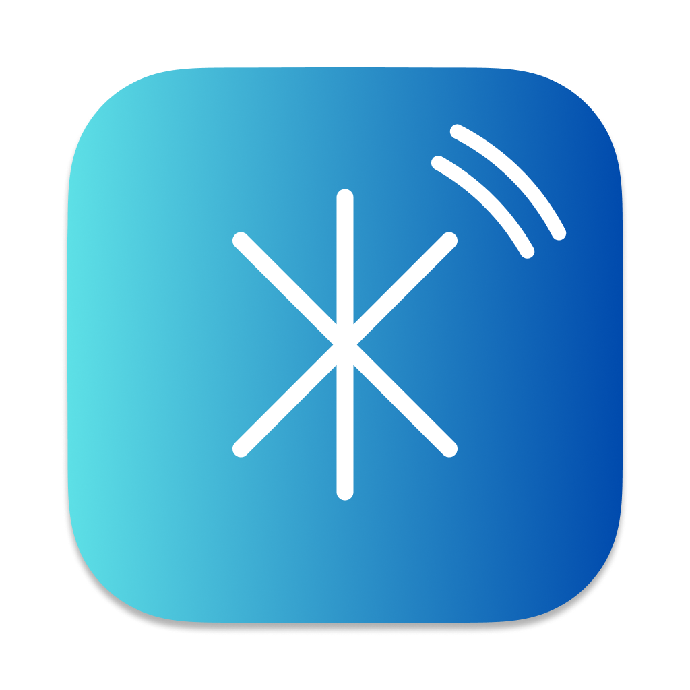
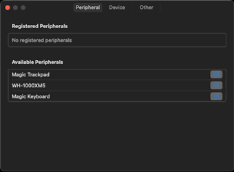
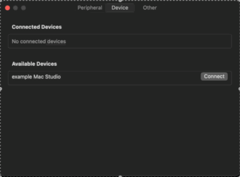
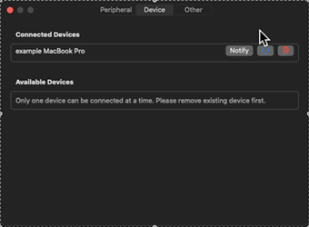
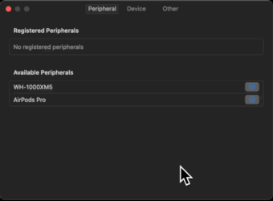

<div align="center">
  <a href="https://github.com/HoshimuraYuto/blue-switch">
    
  </a>
  <h1>Blue Switch</h1>
</div>

<p align="center" style="display: flex; justify-content: center; gap: 20px;">
  <a href="https://ko-fi.com/hoshimurayuto">
    
  </a>
</p>

[English](./README.md) | [日本語](./README.ja.md)

## 🌟 Blue Switch とは？

Blue Switch は、**Magic Keyboard**や**Magic Trackpad**、**Magic Mouse**などの Bluetooth デバイスを、ワンクリックで接続先を切り替えられる macOS アプリケーションです。

線接続や KVM スイッチが不要で、完全なワイヤレス環境を実現します。

### 🚀 主な特徴

- 🔌 **ハードウェア不要**: KVM スイッチやケーブルは一切不要
- 📱 **完全ワイヤレス**: Mac 間で瞬時にデバイスを切り替え
- ⚡ **簡単操作**: メニューバーのアイコンをクリックするだけ
- 🔄 **双方向同期**: 2 台の Mac 間でシームレスな切り替え

## 📦 インストール方法

1. [リリースページ](https://github.com/HoshimuraYuto/blue-switch/releases)から最新版をダウンロード
2. zip ファイルを解凍
3. `Blue Switch.app`をアプリケーションフォルダに移動
4. アプリを起動

> ⚠️ 初回起動時にセキュリティ警告が表示された場合：
>
> - システム環境設定 > セキュリティとプライバシー > セキュリティから`Open Anyway`を選択

## ❓ 基本的な使い方

| 操作                           | 機能         | 説明                                                      |
| ------------------------------ | ------------ | --------------------------------------------------------- |
| メニューバーアイコン左クリック | デバイス切替 | Magic Keyboard や Magic Trackpad の接続先を瞬時に切り替え |
| メニューバーアイコン右クリック | 設定         | デバイスの登録や詳細設定を開く                            |

## 🔧 セットアップ手順

### 1. アプリの準備 🖥️

- 切り替えたい 2 台の Mac に Blue Switch をインストール
- 各 Mac のメニューバーに Blue Switch アイコン（`*`形状）が表示されることを確認
- アイコンを右クリックし、「Settings」を選択

### 2. デバイスの登録 🔌

- 設定画面の「Peripheral」タブを開く
- 「Available Peripherals」から使用する Bluetooth デバイスを選択
- デバイスが「Registered Peripherals」に追加されたことを確認



> ⚠️ **デバイスが表示されない場合**
>
> - デバイスの電源が入っているか確認
> - 設定アプリ > プライバシーとセキュリティ > Bluetooth で Blue Switch が有効になっているか確認

### 3. PC 間の接続設定 🔗

- 設定画面の「Device」タブを開く
- 「Available Devices」から接続したい相手の Mac を選択
- 選択した Mac が「Connected Devices」に表示されることを確認



> ⚠️ **PC が表示されない場合**
>
> - 相手 PC で Blue Switch が起動しているか確認
> - ネットワーク接続を確認

> 💡 注意: 相手側からの切り替えを可能にするには、相手の Mac でも同様の設定が必要

4. **デバイス情報の同期** 🔄

- 青色の同期ボタンをクリック
- Bluetooth デバイス情報が相手の Mac に自動的に共有
- 相手の Mac の「Peripheral」タブで共有状態を確認




### 5. 動作確認 ✅

- メニューバーのアイコンをクリックして、デバイス切り替えが正常に動作することを確認

> ⚠️ **うまく切り替わらない場合**
>
> - ネットワーク接続を確認
> - システム設定 > プライバシーとセキュリティ > ローカルネットワークで Blue Switch が有効か確認
> - ネットワーク > ファイアウォール > オプションで Blue Switch が許可されているか確認

## ⚡️ トラブルシューティング

問題が発生した場合は、以下を確認してください：

- 両方の PC で Blue Switch が起動しているか
- デバイスの電源が入っているか
- ネットワーク接続が正常か
- Bluetooth が有効になっているか
- ファイアウォールでブロックしていないか
- Bluetooth、ローカルネットワークをアプリで許可しているか

## 💻 開発者向け情報

### 必要環境

- Xcode 16.1 以降
- Swift 6.0.2 以降

### ビルド方法

```bash
git clone https://github.com/HoshimuraYuto/blue-switch.git
```

### 開発環境のセットアップ

1. git hooks を設定

```bash
sh ./setup-hooks.sh
```

このセットアップには以下が含まれます:

- コミット前の自動コードフォーマット
- コミットメッセージが [Angular Commit Message Conventions](https://github.com/angular/angular/blob/master/CONTRIBUTING.md#-commit-message-format)の形式になっているかチェック

## 🤝 コントリビュート

### 💝 プロジェクトを支援

- [Ko-fi](https://ko-fi.com/hoshimurayuto)で開発者を応援

<a href="https://ko-fi.com/hoshimurayuto">
  
</a>

## 📢 プロジェクトを広める

- プロジェクトに ⭐️ をつける
- Twitter や SNS でプロジェクトをシェア
- ブログや技術記事で紹介

### 🤝 プロジェクトに貢献

1. リポジトリをフォーク
2. フィーチャーブランチを作成
3. 変更をコミット
4. ブランチにプッシュ
5. プルリクエストを作成

## 📜 ライセンス

このプロジェクトは GNU General Public License v3.0 ライセンスの下でライセンスされています。詳細は[LICENSE](https://github.com/HoshimuraYuto/blue-switch/blob/main/LICENSE)ファイルを参照してください。
