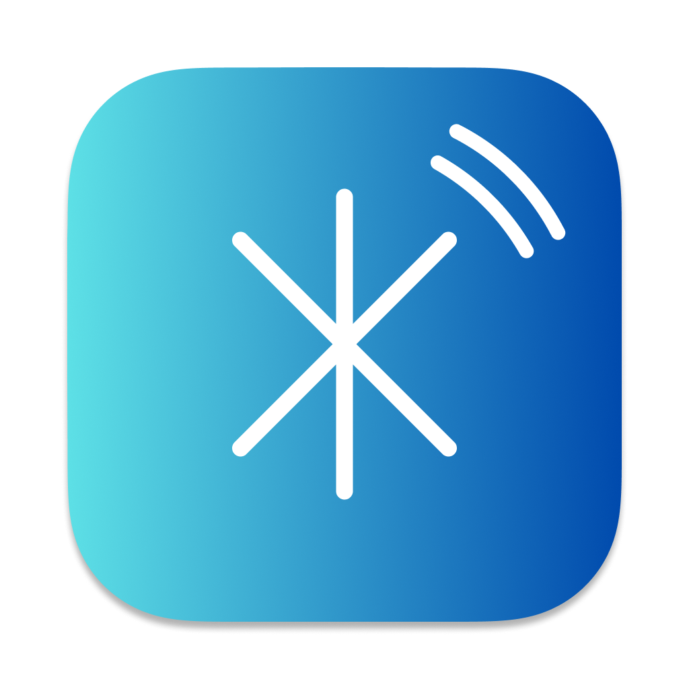
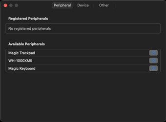
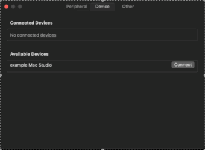
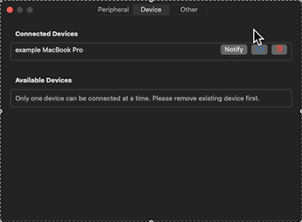
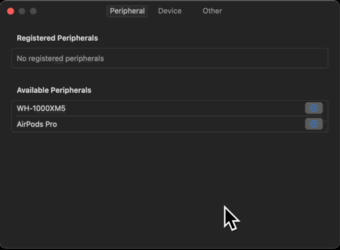

<div align="center">
  <a href="https://github.com/HoshimuraYuto/blue-switch">
    
  </a>
  <h1>Blue Switch</h1>
</div>

<p align="center" style="display: flex; justify-content: center; gap: 20px;">
  <a href="https://ko-fi.com/hoshimurayuto">
    
  </a>
</p>

[English](./README.md) | [日本語](./README.ja.md)

## 🌟 What is Blue Switch?

Blue Switch is a macOS application that allows you to switch Bluetooth devices like **Magic Keyboard**, **Magic Trackpad**, and **Magic Mouse** between computers with just one click.

No wired connections or KVM switches needed, enabling a completely wireless environment.

### 🚀 Key Features

- 🔌 **No Hardware Required**: No KVM switches or cables needed
- 📱 **Completely Wireless**: Instantly switch devices between Macs
- ⚡ **Simple Operation**: Just click the menu bar icon
- 🔄 **Two-way Sync**: Seamless switching between two Macs

## 📦 Installation

1. Download the latest version from the [releases page](https://github.com/HoshimuraYuto/blue-switch/releases)
2. Unzip the file
3. Move `Blue Switch.app` to your Applications folder
4. Launch the app

> ⚠️ If you see a security warning on first launch:
>
> - Go to System Preferences > Security & Privacy > Security and select `Open Anyway`

## ❓ Basic Usage

| Action                    | Function      | Description                                                   |
| ------------------------- | ------------- | ------------------------------------------------------------- |
| Left-click menu bar icon  | Switch Device | Instantly switch Magic Keyboard and Magic Trackpad connection |
| Right-click menu bar icon | Settings      | Open device registration and detailed settings                |

## 🔧 Setup Instructions

### 1. App Preparation 🖥️

- Install Blue Switch on both Macs you want to switch between
- Confirm the Blue Switch icon (`*` shape) appears in the menu bar on each Mac
- Right-click the icon and select "Settings"

### 2. Device Registration 🔌

- Open the "Peripheral" tab in settings
- Select the Bluetooth devices you want to use from "Available Peripherals"
- Confirm the devices appear under "Registered Peripherals"



> ⚠️ **If devices don't appear**
>
> - Check if the device is powered on
> - Check if Blue Switch is enabled in Settings app > Privacy & Security > Bluetooth

### 3. PC Connection Setup 🔗

- Open the "Device" tab in settings
- Select the Mac you want to connect to from "Available Devices"
- Confirm the selected Mac appears under "Connected Devices"



> ⚠️ **If PC doesn't appear**
>
> - Check if Blue Switch is running on the other PC
> - Check network connection

> 💡 Note: The same setup is required on the other Mac to enable switching from both sides

### 4. Device Information Sync 🔄

- Click the blue sync button
- Bluetooth device information is automatically shared with the other Mac
- Check sharing status in the "Peripheral" tab on the other Mac




### 5. Operation Check ✅

- Click the menu bar icon to confirm device switching works properly

> ⚠️ **If switching doesn't work**
>
> - Check network connection
> - Check if Blue Switch is enabled in System Settings > Privacy & Security > Local Network
> - Check if Blue Switch is allowed in Network > Firewall > Options

## ⚡️ Troubleshooting

If you encounter issues, check the following:

- Blue Switch is running on both PCs
- Devices are powered on
- Network connection is working
- Bluetooth is enabled
- Not blocked by firewall
- Bluetooth and Local Network permissions are granted

## 💻 Developer Information

### Requirements

- Xcode 16.1 or later
- Swift 6.0.2 or later

### Build Instructions

```bash
git clone https://github.com/HoshimuraYuto/blue-switch.git
```

### Development Environment Setup

1. Set up git hooks

```bash
sh ./setup-hooks.sh
```

This setup includes:

- Automatic code formatting before commits
- Checking if commit messages follow [Angular Commit Message Conventions](https://github.com/angular/angular/blob/master/CONTRIBUTING.md#-commit-message-format)

## 🤝 Contributing

### 💝 Support the Project

- Support the developer on [Ko-fi](https://ko-fi.com/hoshimurayuto)

<a href="https://ko-fi.com/hoshimurayuto">
  
</a>

## 📢 Spread the Project

- Give the project a ⭐️
- Share the project on Twitter and social media
- Write about it in blogs and technical articles

### 🤝 Project Contributions

1. Fork the repository
2. Create a feature branch
3. Commit your changes
4. Push to the branch
5. Create a Pull Request

## 📜 License

This project is licensed under the GNU General Public License v3.0. See the [LICENSE](https://github.com/HoshimuraYuto/blue-switch/blob/main/LICENSE) file for details.
